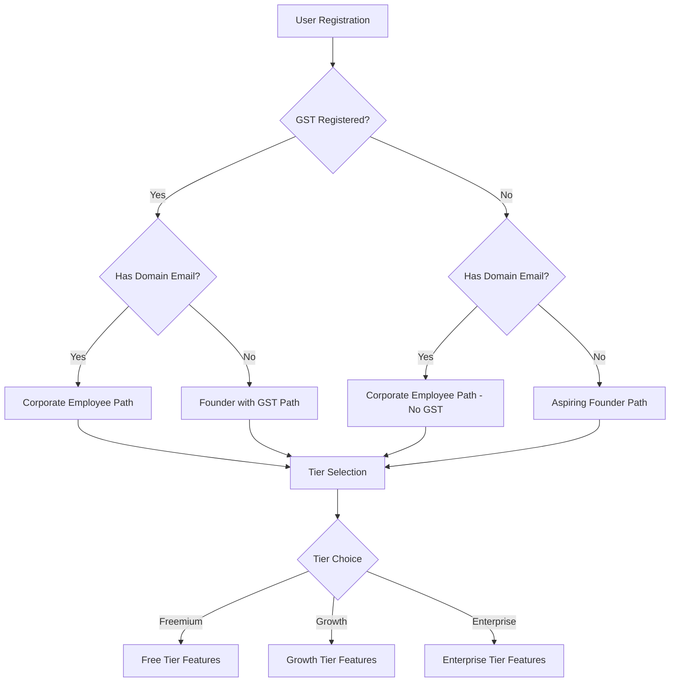
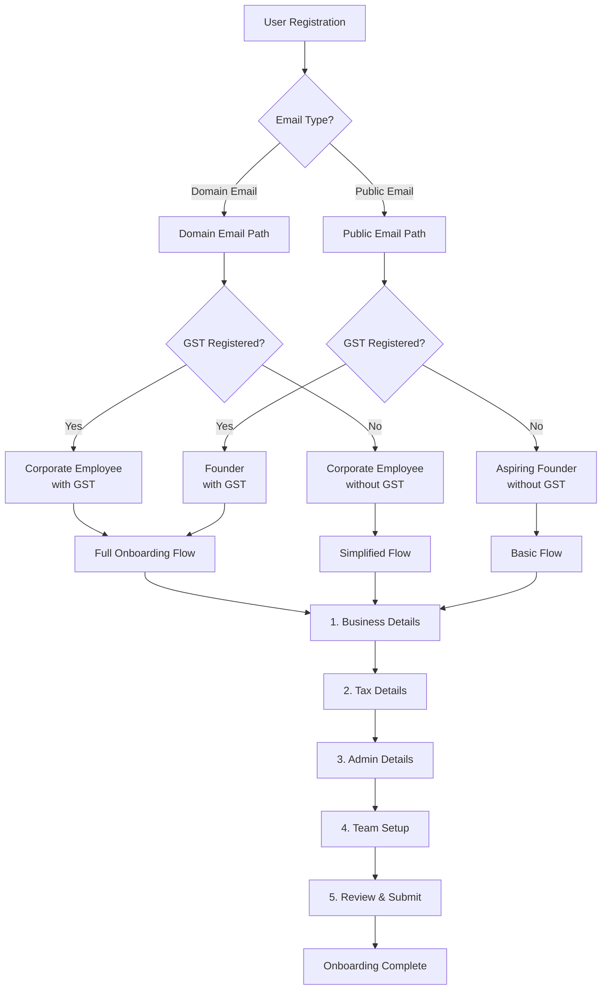

# Comprehensive Onboarding Flow Enhancement Plan

## Executive Summary

This document outlines a comprehensive enhancement plan for the onboarding flow based on the provided user journey diagrams and existing implementation analysis. The plan addresses categorization logic, geographic localization, step sequence restructuring, review page enhancement, and validation rules.

---

## 1. User Categorization Logic & Decision Matrix

### 1.1 Categorization Dimensions

Based on the provided diagrams, users are categorized across three primary dimensions:

1. **GST Registration Status**: With GST / Without GST
2. **Email Domain Type**: Domain Email / Non-Domain Email  
3. **User Role**: Corporate Employee / Founder

### 1.2 Complete Decision Matrix



### 1.3 Categorization Rules Table

| GST Status | Domain Email | User Type | Default Role | Tier Options | Key Features |
|------------|--------------|-----------|--------------|--------------|--------------|
| ✅ With GST | ✅ Domain | Corporate Employee | Beginner Founder/Corporate Employee | Freemium → Growth → Enterprise | Full compliance, invoicing, team features |
| ✅ With GST | ❌ No Domain | Founder | Beginner Founder | Freemium → Growth → Enterprise | GST compliance, limited team features initially |
| ❌ No GST | ✅ Domain | Corporate Employee | Corporate Employee | Freemium → Growth | Basic features, upgrade path for GST |
| ❌ No GST | ❌ No Domain | Aspiring Founder | All Free User | Freemium only initially | Basic CRM, limited features, upgrade prompts |

### 1.4 Classification Logic Implementation

```typescript
interface UserClassificationInput {
  hasGST: boolean;
  hasDomainEmail: boolean;
  emailDomain?: string;
  gstNumber?: string;
}

interface UserClassificationResult {
  userType: 'corporateEmployee' | 'founder' | 'aspiringFounder';
  defaultRole: string;
  tierOptions: string[];
  features: string[];
  requiresGSTVerification: boolean;
  requiresDomainVerification: boolean;
  onboardingPath: 'full' | 'simplified' | 'enterprise';
}

function classifyUser(input: UserClassificationInput): UserClassificationResult {
  // Scenario 1: GST + Domain Email = Corporate Employee
  if (input.hasGST && input.hasDomainEmail) {
    return {
      userType: 'corporateEmployee',
      defaultRole: 'Beginner Founder/Corporate Employee',
      tierOptions: ['freemium', 'growth', 'enterprise'],
      features: [
        'Full B2B CRM',
        'Project Management',
        'HRMS with Payroll',
        'Operations Management',
        'GST Invoicing',
        'Financial Accounting'
      ],
      requiresGSTVerification: true,
      requiresDomainVerification: true,
      onboardingPath: 'full'
    };
  }
  
  // Scenario 2: GST + No Domain = Founder with GST
  if (input.hasGST && !input.hasDomainEmail) {
    return {
      userType: 'founder',
      defaultRole: 'Beginner Founder',
      tierOptions: ['freemium', 'growth', 'enterprise'],
      features: [
        'B2B CRM (Excluding Form Builder)',
        'Project Management (Limited)',
        'Training Materials',
        'GST Compliance Modules'
      ],
      requiresGSTVerification: true,
      requiresDomainVerification: false,
      onboardingPath: 'full'
    };
  }
  
  // Scenario 3: No GST + Domain Email = Corporate Employee (No GST)
  if (!input.hasGST && input.hasDomainEmail) {
    return {
      userType: 'corporateEmployee',
      defaultRole: 'Corporate Employee',
      tierOptions: ['freemium', 'growth'],
      features: [
        'B2B CRM (Leads, Contacts, Accounts, Opportunities)',
        'Project Management (Excluding Workspace Creation)',
        'Training Materials'
      ],
      requiresGSTVerification: false,
      requiresDomainVerification: true,
      onboardingPath: 'simplified'
    };
  }
  
  // Scenario 4: No GST + No Domain = Aspiring Founder
  if (!input.hasGST && !input.hasDomainEmail) {
    return {
      userType: 'aspiringFounder',
      defaultRole: 'All Free User',
      tierOptions: ['freemium'],
      features: [
        'B2B CRM (Leads, Contacts, Accounts, Opportunities)',
        'Project Management (Excluding Workspace Creation)',
        'Training Materials (Dopkit Academy)'
      ],
      requiresGSTVerification: false,
      requiresDomainVerification: false,
      onboardingPath: 'simplified'
    };
  }
  
  // Default fallback
  return {
    userType: 'aspiringFounder',
    defaultRole: 'All Free User',
    tierOptions: ['freemium'],
    features: ['Basic CRM'],
    requiresGSTVerification: false,
    requiresDomainVerification: false,
    onboardingPath: 'simplified'
  };
}
```

### 1.5 Domain Email Verification Logic

```typescript
interface DomainVerificationResult {
  isDomainEmail: boolean;
  domain: string | null;
  isPublicDomain: boolean;
  verificationRequired: boolean;
}

const PUBLIC_EMAIL_DOMAINS = [
  'gmail.com', 'yahoo.com', 'outlook.com', 'hotmail.com',
  'icloud.com', 'aol.com', 'protonmail.com', 'mail.com'
];

function verifyEmailDomain(email: string): DomainVerificationResult {
  const domain = email.split('@')[1]?.toLowerCase();
  
  if (!domain) {
    return {
      isDomainEmail: false,
      domain: null,
      isPublicDomain: true,
      verificationRequired: false
    };
  }
  
  const isPublicDomain = PUBLIC_EMAIL_DOMAINS.includes(domain);
  
  return {
    isDomainEmail: !isPublicDomain,
    domain: domain,
    isPublicDomain: isPublicDomain,
    verificationRequired: !isPublicDomain
  };
}
```

---

## 2. Geographic Localization System

### 2.1 Country-Based Configuration

```typescript
interface CountryConfig {
  code: string;
  name: string;
  currency: string;
  currencySymbol: string;
  language: string;
  locale: string;
  dateFormat: string;
  phoneFormat: string;
  timezone: string;
  hasStates: boolean;
  taxSystem: {
    name: string;
    idLabel: string;
    vatLabel: string;
    required: boolean;
  };
}

const COUNTRY_CONFIGS: Record<string, CountryConfig> = {
  IN: {
    code: 'IN',
    name: 'India',
    currency: 'INR',
    currencySymbol: '₹',
    language: 'en',
    locale: 'en-IN',
    dateFormat: 'DD/MM/YYYY',
    phoneFormat: '+91 XXXXX XXXXX',
    timezone: 'Asia/Kolkata',
    hasStates: true,
    taxSystem: {
      name: 'GST',
      idLabel: 'PAN Number',
      vatLabel: 'GSTIN',
      required: true
    }
  },
  US: {
    code: 'US',
    name: 'United States',
    currency: 'USD',
    currencySymbol: '$',
    language: 'en',
    locale: 'en-US',
    dateFormat: 'MM/DD/YYYY',
    phoneFormat: '+1 (XXX) XXX-XXXX',
    timezone: 'America/New_York',
    hasStates: true,
    taxSystem: {
      name: 'Federal Tax',
      idLabel: 'EIN',
      vatLabel: 'Sales Tax ID',
      required: false
    }
  },
  UK: {
    code: 'UK',
    name: 'United Kingdom',
    currency: 'GBP',
    currencySymbol: '£',
    language: 'en',
    locale: 'en-GB',
    dateFormat: 'DD/MM/YYYY',
    phoneFormat: '+44 XXXX XXXXXX',
    timezone: 'Europe/London',
    hasStates: false,
    taxSystem: {
      name: 'VAT',
      idLabel: 'UTR',
      vatLabel: 'VAT Number',
      required: false
    }
  },
  CA: {
    code: 'CA',
    name: 'Canada',
    currency: 'CAD',
    currencySymbol: 'C$',
    language: 'en',
    locale: 'en-CA',
    dateFormat: 'YYYY-MM-DD',
    phoneFormat: '+1 (XXX) XXX-XXXX',
    timezone: 'America/Toronto',
    hasStates: true,
    taxSystem: {
      name: 'GST/HST',
      idLabel: 'Business Number',
      vatLabel: 'GST/HST Number',
      required: false
    }
  },
  AU: {
    code: 'AU',
    name: 'Australia',
    currency: 'AUD',
    currencySymbol: 'A$',
    language: 'en',
    locale: 'en-AU',
    dateFormat: 'DD/MM/YYYY',
    phoneFormat: '+61 XXX XXX XXX',
    timezone: 'Australia/Sydney',
    hasStates: true,
    taxSystem: {
      name: 'GST',
      idLabel: 'TFN',
      vatLabel: 'ABN/ACN',
      required: false
    }
  }
};
```

### 2.2 State Field Conditional Visibility

```typescript
interface StateFieldConfig {
  visible: boolean;
  required: boolean;
  label: string;
  options: Array<{ id: string; name: string }>;
}

function getStateFieldConfig(countryCode: string): StateFieldConfig {
  const config = COUNTRY_CONFIGS[countryCode];
  
  if (!config || !config.hasStates) {
    return {
      visible: false,
      required: false,
      label: 'State/Province',
      options: []
    };
  }
  
  // For India, return Indian states
  if (countryCode === 'IN') {
    return {
      visible: true,
      required: true,
      label: 'State',
      options: INDIAN_STATES // From existing schema
    };
  }
  
  // For US, return US states
  if (countryCode === 'US') {
    return {
      visible: true,
      required: true,
      label: 'State',
      options: US_STATES
    };
  }
  
  // For Canada, return provinces
  if (countryCode === 'CA') {
    return {
      visible: true,
      required: true,
      label: 'Province/Territory',
      options: CANADIAN_PROVINCES
    };
  }
  
  // For Australia, return states/territories
  if (countryCode === 'AU') {
    return {
      visible: true,
      required: true,
      label: 'State/Territory',
      options: AUSTRALIAN_STATES
    };
  }
  
  return {
    visible: false,
    required: false,
    label: 'State/Province',
    options: []
  };
}
```

### 2.3 Auto-Population Logic

```typescript
interface LocalizationSettings {
  currency: string;
  language: string;
  locale: string;
  dateFormat: string;
  phoneFormat: string;
  timezone: string;
  taxLabels: {
    taxId: string;
    vatId: string;
  };
}

function autoPopulateLocalization(countryCode: string): LocalizationSettings {
  const config = COUNTRY_CONFIGS[countryCode] || COUNTRY_CONFIGS['IN'];
  
  return {
    currency: config.currency,
    language: config.language,
    locale: config.locale,
    dateFormat: config.dateFormat,
    phoneFormat: config.phoneFormat,
    timezone: config.timezone,
    taxLabels: {
      taxId: config.taxSystem.idLabel,
      vatId: config.taxSystem.vatLabel
    }
  };
}
```

---

## 3. Step Sequence Restructuring

### 3.1 Current Flow vs. New Flow

#### Current Flow (from flowConfigs.ts)
```
1. Company Type
2. State
3. Business Details
4. Team
5. Personal Details ❌ (TO BE REMOVED)
6. Tax Details
7. Admin Details
8. Preferences
9. Review
```

#### New Restructured Flow
```
1. Business Details (Company info, type, size, country, description)
2. Tax Details (GST/VAT registration, tax IDs, addresses)
3. Admin Details (Admin contact, emails, phones, website)
4. Team Setup (Team members - MOVED FROM STEP 4)
5. Review (Comprehensive summary - ENHANCED)
```

### 3.2 Step Configuration Updates

```typescript
// Updated flow configuration
export const RESTRUCTURED_FLOW_CONFIG = {
  newBusiness: {
    id: 'newBusiness',
    name: 'New Business',
    description: 'Onboard a new business',
    steps: [
      { 
        id: 'businessDetails', 
        number: 1, 
        title: 'Business Details',
        description: 'Company information and business profile',
        fields: [
          'businessDetails.companyName',
          'businessDetails.businessType',
          'businessDetails.organizationSize',
          'businessDetails.country',
          'businessDetails.description',
          'industry',
          'gstin' // Conditional based on classification
        ]
      },
      { 
        id: 'taxDetails', 
        number: 2, 
        title: 'Tax Details',
        description: 'Tax registration and compliance information',
        fields: [
          'taxRegistered',
          'vatGstRegistered',
          'gstin',
          'panNumber',
          'cinNumber',
          'vatNumber',
          'einNumber',
          'incorporationState', // Conditional based on country
          'billingAddress',
          'billingCity',
          'billingState',
          'billingZip',
          'mailingAddressSameAsRegistered',
          'mailingAddress',
          'mailingCity',
          'mailingState',
          'mailingZip'
        ]
      },
      { 
        id: 'adminDetails', 
        number: 3, 
        title: 'Admin Details',
        description: 'Administrator and contact information',
        fields: [
          'adminEmail',
          'adminMobile',
          'contactSalutation',
          'contactJobTitle',
          'contactMiddleName',
          'contactDepartment',
          'contactAuthorityLevel',
          'preferredContactMethod',
          'contactDirectPhone',
          'contactMobilePhone',
          'billingEmail',
          'supportEmail',
          'website'
        ]
      },
      { 
        id: 'teamSetup', 
        number: 4, 
        title: 'Team Setup',
        description: 'Add team members and assign roles',
        fields: [
          'teamMembers'
        ]
      },
      { 
        id: 'review', 
        number: 5, 
        title: 'Review & Submit',
        description: 'Review all information before submission',
        fields: [
          'termsAccepted'
        ]
      }
    ]
  },
  existingBusiness: {
    id: 'existingBusiness',
    name: 'Existing Business',
    description: 'Onboard an existing business',
    steps: [
      // Same structure as newBusiness
      { id: 'businessDetails', number: 1, title: 'Business Details' },
      { id: 'taxDetails', number: 2, title: 'Tax Details' },
      { id: 'adminDetails', number: 3, title: 'Admin Details' },
      { id: 'teamSetup', number: 4, title: 'Team Setup' },
      { id: 'review', number: 5, title: 'Review & Submit' }
    ]
  }
};
```

### 3.3 Personal Details Step Elimination

The Personal Details step will be eliminated because:
1. Admin details are captured in the Admin Details step
2. Personal information is redundant with admin contact information
3. Streamlines the flow from 9 steps to 5 steps
4. Reduces user friction and completion time

**Migration Strategy:**
- Move any unique fields from Personal Details to Admin Details
- Update form validation to ensure all required personal data is captured in Admin Details
- Update backend services to map old Personal Details fields to new Admin Details structure

---

## 4. Enhanced Review Page Design

### 4.1 Review Page Structure

```typescript
interface ReviewPageSection {
  id: string;
  title: string;
  icon: React.ComponentType;
  stepNumber: number;
  fields: ReviewField[];
  editable: boolean;
}

interface ReviewField {
  label: string;
  value: any;
  fieldPath: string;
  formatter?: (value: any) => string;
  conditional?: boolean;
}

const REVIEW_PAGE_SECTIONS: ReviewPageSection[] = [
  {
    id: 'businessDetails',
    title: 'Business Details',
    icon: Building2,
    stepNumber: 1,
    editable: true,
    fields: [
      { label: 'Company Name', value: 'businessDetails.companyName', fieldPath: 'businessDetails.companyName' },
      { label: 'Business Type', value: 'businessDetails.businessType', fieldPath: 'businessDetails.businessType' },
      { label: 'Organization Size', value: 'businessDetails.organizationSize', fieldPath: 'businessDetails.organizationSize', formatter: getSizeName },
      { label: 'Country', value: 'businessDetails.country', fieldPath: 'businessDetails.country', formatter: getCountryName },
      { label: 'Industry', value: 'industry', fieldPath: 'industry' },
      { label: 'Description', value: 'businessDetails.description', fieldPath: 'businessDetails.description' },
      { label: 'GSTIN', value: 'gstin', fieldPath: 'gstin', conditional: true }
    ]
  },
  {
    id: 'taxDetails',
    title: 'Tax & Compliance',
    icon: FileText,
    stepNumber: 2,
    editable: true,
    fields: [
      { label: 'Tax Registered', value: 'taxRegistered', fieldPath: 'taxRegistered', formatter: formatBoolean },
      { label: 'VAT/GST Registered', value: 'vatGstRegistered', fieldPath: 'vatGstRegistered', formatter: formatBoolean },
      { label: 'PAN Number', value: 'panNumber', fieldPath: 'panNumber', conditional: true },
      { label: 'GSTIN', value: 'gstin', fieldPath: 'gstin', conditional: true },
      { label: 'CIN Number', value: 'cinNumber', fieldPath: 'cinNumber', conditional: true },
      { label: 'Incorporation State', value: 'incorporationState', fieldPath: 'incorporationState', conditional: true },
      { label: 'Billing Address', value: 'billingAddress', fieldPath: 'billingAddress' },
      { label: 'City', value: 'billingCity', fieldPath: 'billingCity' },
      { label: 'State', value: 'billingState', fieldPath: 'billingState' },
      { label: 'Postal Code', value: 'billingZip', fieldPath: 'billingZip' },
      { label: 'Mailing Address Same', value: 'mailingAddressSameAsRegistered', fieldPath: 'mailingAddressSameAsRegistered', formatter: formatBoolean }
    ]
  },
  {
    id: 'adminDetails',
    title: 'Administrator & Contact',
    icon: User,
    stepNumber: 3,
    editable: true,
    fields: [
      { label: 'Admin Email', value: 'adminEmail', fieldPath: 'adminEmail' },
      { label: 'Admin Mobile', value: 'adminMobile', fieldPath: 'adminMobile' },
      { label: 'Salutation', value: 'contactSalutation', fieldPath: 'contactSalutation' },
      { label: 'Job Title', value: 'contactJobTitle', fieldPath: 'contactJobTitle' },
      { label: 'Department', value: 'contactDepartment', fieldPath: 'contactDepartment' },
      { label: 'Authority Level', value: 'contactAuthorityLevel', fieldPath: 'contactAuthorityLevel' },
      { label: 'Preferred Contact Method', value: 'preferredContactMethod', fieldPath: 'preferredContactMethod' },
      { label: 'Direct Phone', value: 'contactDirectPhone', fieldPath: 'contactDirectPhone' },
      { label: 'Mobile Phone', value: 'contactMobilePhone', fieldPath: 'contactMobilePhone' },
      { label: 'Billing Email', value: 'billingEmail', fieldPath: 'billingEmail' },
      { label: 'Support Email', value: 'supportEmail', fieldPath: 'supportEmail' },
      { label: 'Website', value: 'website', fieldPath: 'website' }
    ]
  },
  {
    id: 'teamSetup',
    title: 'Team Members',
    icon: Users,
    stepNumber: 4,
    editable: true,
    fields: [
      { label: 'Team Members', value: 'teamMembers', fieldPath: 'teamMembers', formatter: formatTeamMembers }
    ]
  }
];
```

### 4.2 Review Page Features

1. **Comprehensive Summary Display**
   - All sections displayed in collapsible cards
   - Clear visual hierarchy with icons
   - Grouped by logical sections

2. **Edit Functionality**
   - Each section has an "Edit" button
   - Clicking edit navigates back to that specific step
   - Form data is preserved during navigation

3. **Conditional Field Display**
   - Only show fields that have values
   - Hide conditional fields that don't apply to user's classification
   - Show/hide based on country selection (e.g., state field)

4. **Visual Indicators**
   - Completion status for each section
   - Required field indicators
   - Validation status badges

5. **Terms & Conditions**
   - Prominent checkbox at the bottom
   - Required to proceed
   - Links to actual T&C and Privacy Policy documents

### 4.3 Review Page Component Structure

```typescript
interface EnhancedReviewStepProps {
  form: UseFormReturn<OnboardingData>;
  onEditStep: (stepNumber: number) => void;
  userClassification: UserClassification;
  countryConfig: CountryConfig;
}

const EnhancedReviewStep: React.FC<EnhancedReviewStepProps> = ({
  form,
  onEditStep,
  userClassification,
  countryConfig
}) => {
  const values = form.getValues();
  
  const renderSection = (section: ReviewPageSection) => {
    const visibleFields = section.fields.filter(field => {
      // Hide conditional fields if they don't apply
      if (field.conditional) {
        return shouldShowField(field, values, userClassification, countryConfig);
      }
      return true;
    });
    
    return (
      <ReviewSection
        key={section.id}
        title={section.title}
        icon={section.icon}
        stepNumber={section.stepNumber}
        fields={visibleFields}
        values={values}
        onEdit={() => onEditStep(section.stepNumber)}
        editable={section.editable}
      />
    );
  };
  
  return (
    <div className="review-container">
      <ReviewHeader userClassification={userClassification} />
      
      <div className="review-sections">
        {REVIEW_PAGE_SECTIONS.map(renderSection)}
      </div>
      
      <TermsAcceptance form={form} />
      
      <SubmitButton form={form} />
    </div>
  );
};
```

---

## 5. Validation Rules Framework

### 5.1 Field-Level Validation Rules

```typescript
interface ValidationRule {
  field: string;
  rules: {
    required?: boolean | ((data: any, classification: UserClassification) => boolean);
    pattern?: RegExp;
    minLength?: number;
    maxLength?: number;
    custom?: (value: any, data: any) => boolean | string;
  };
  errorMessages: {
    required?: string;
    pattern?: string;
    minLength?: string;
    maxLength?: string;
    custom?: string;
  };
}

const VALIDATION_RULES: Record<string, ValidationRule> = {
  // Business Details
  'businessDetails.companyName': {
    field: 'businessDetails.companyName',
    rules: {
      required: true,
      minLength: 2,
      maxLength: 100
    },
    errorMessages: {
      required: 'Company name is required',
      minLength: 'Company name must be at least 2 characters',
      maxLength: 'Company name cannot exceed 100 characters'
    }
  },
  
  'businessDetails.businessType': {
    field: 'businessDetails.businessType',
    rules: {
      required: true
    },
    errorMessages: {
      required: 'Business type is required'
    }
  },
  
  'businessDetails.country': {
    field: 'businessDetails.country',
    rules: {
      required: true
    },
    errorMessages: {
      required: 'Country is required'
    }
  },
  
  // GST - Conditional based on classification
  'gstin': {
    field: 'gstin',
    rules: {
      required: (data, classification) => {
        return classification === 'withGST' || data.vatGstRegistered === true;
      },
      pattern: /^[0-9]{2}[A-Z]{5}[0-9]{4}[A-Z]{1}[1-9A-Z]{1}Z[0-9A-Z]{1}$/,
      custom: (value, data) => {
        if (data.businessDetails?.country === 'IN' && data.vatGstRegistered) {
          return !!value;
        }
        return true;
      }
    },
    errorMessages: {
      required: 'GSTIN is required for GST registered businesses',
      pattern: 'Invalid GSTIN format (e.g., 22AAAAA0000A1Z5)',
      custom: 'GSTIN is required when VAT/GST registered in India'
    }
  },
  
  // Tax Details
  'panNumber': {
    field: 'panNumber',
    rules: {
      required: (data, classification) => {
        return data.businessDetails?.country === 'IN' && data.taxRegistered === true;
      },
      pattern: /^[A-Z]{5}[0-9]{4}[A-Z]{1}$/
    },
    errorMessages: {
      required: 'PAN number is required for tax registered businesses in India',
      pattern: 'Invalid PAN format (e.g., ABCDE1234F)'
    }
  },
  
  'incorporationState': {
    field: 'incorporationState',
    rules: {
      required: (data, classification) => {
        const config = COUNTRY_CONFIGS[data.businessDetails?.country || 'IN'];
        return config?.hasStates === true;
      }
    },
    errorMessages: {
      required: 'State is required for your selected country'
    }
  },
  
  // Admin Details
  'adminEmail': {
    field: 'adminEmail',
    rules: {
      required: true,
      pattern: /^[^\s@]+@[^\s@]+\.[^\s@]+$/,
      custom: async (value, data) => {
        // Check for duplicates
        const result = await checkEmailAvailability(value);
        return result.available;
      }
    },
    errorMessages: {
      required: 'Admin email is required',
      pattern: 'Invalid email format',
      custom: 'This email is already registered'
    }
  },
  
  'adminMobile': {
    field: 'adminMobile',
    rules: {
      required: (data, classification) => {
        return classification === 'withGST' || classification === 'enterprise';
      },
      pattern: /^\+?[\d\s\-\(\)]+$/
    },
    errorMessages: {
      required: 'Mobile number is required for verification',
      pattern: 'Invalid phone number format'
    }
  },
  
  'supportEmail': {
    field: 'supportEmail',
    rules: {
      required: true,
      pattern: /^[^\s@]+@[^\s@]+\.[^\s@]+$/
    },
    errorMessages: {
      required: 'Support email is required',
      pattern: 'Invalid email format'
    }
  },
  
  'website': {
    field: 'website',
    rules: {
      required: true,
      pattern: /^https?:\/\/.+\..+/
    },
    errorMessages: {
      required: 'Company website is required',
      pattern: 'Invalid URL format (must start with http:// or https://)'
    }
  },
  
  // Terms
  'termsAccepted': {
    field: 'termsAccepted',
    rules: {
      required: true,
      custom: (value) => value === true
    },
    errorMessages: {
      required: 'You must accept the terms and conditions',
      custom: 'You must accept the terms and conditions to continue'
    }
  }
};
```

### 5.2 Step-Level Validation

```typescript
interface StepValidation {
  stepId: string;
  validate: (data: any, classification: UserClassification) => ValidationResult;
}

interface ValidationResult {
  isValid: boolean;
  errors: Array<{ field: string; message: string }>;
}

const STEP_VALIDATIONS: Record<string, StepValidation> = {
  businessDetails: {
    stepId: 'businessDetails',
    validate: (data, classification) => {
      const errors: Array<{ field: string; message: string }> = [];
      
      // Required fields
      if (!data.businessDetails?.companyName) {
        errors.push({ field: 'businessDetails.companyName', message: 'Company name is required' });
      }
      
      if (!data.businessDetails?.businessType) {
        errors.push({ field: 'businessDetails.businessType', message: 'Business type is required' });
      }
      
      if (!data.businessDetails?.country) {
        errors.push({ field: 'businessDetails.country', message: 'Country is required' });
      }
      
      // Conditional: GSTIN for withGST classification
      if (classification === 'withGST' && !data.gstin) {
        errors.push({ field: 'gstin', message: 'GSTIN is required for GST registered businesses' });
      }
      
      return {
        isValid: errors.length === 0,
        errors
      };
    }
  },
  
  taxDetails: {
    stepId: 'taxDetails',
    validate: (data, classification) => {
      const errors: Array<{ field: string; message: string }> = [];
      const country = data.businessDetails?.country || 'IN';
      const config = COUNTRY_CONFIGS[country];
      
      // Billing address required
      if (!data.billingAddress) {
        errors.push({ field: 'billingAddress', message: 'Billing address is required' });
      }
      
      if (!data.billingCity) {
        errors.push({ field: 'billingCity', message: 'City is required' });
      }
      
      if (!data.billingZip) {
        errors.push({ field: 'billingZip', message: 'Postal code is required' });
      }
      
      // State required if country has states
      if (config?.hasStates && !data.incorporationState) {
        errors.push({ field: 'incorporationState', message: 'State is required' });
      }
      
      // Tax registration validations
      if (data.taxRegistered) {
        if (country === 'IN' && !data.panNumber) {
          errors.push({ field: 'panNumber', message: 'PAN number is required' });
        }
        if (country === 'US' && !data.einNumber) {
          errors.push({ field: 'einNumber', message: 'EIN is required' });
        }
      }
      
      if (data.vatGstRegistered) {
        if (country === 'IN' && !data.gstin) {
          errors.push({ field: 'gstin', message: 'GSTIN is required' });
        }
        if (country !== 'IN' && !data.vatNumber) {
          errors.push({ field: 'vatNumber', message: 'VAT number is required' });
        }
      }
      
      // Mailing address validation if different
      if (data.mailingAddressSameAsRegistered === false) {
        if (!data.mailingAddress) {
          errors.push({ field: 'mailingAddress', message: 'Mailing address is required' });
        }
        if (!data.mailingCity) {
          errors.push({ field: 'mailingCity', message: 'Mailing city is required' });
        }
        if (!data.mailingZip) {
          errors.push({ field: 'mailingZip', message: 'Mailing postal code is required' });
        }
      }
      
      return {
        isValid: errors.length === 0,
        errors
      };
    }
  },
  
  adminDetails: {
    stepId: 'adminDetails',
    validate: (data, classification) => {
      const errors: Array<{ field: string; message: string }> = [];
      
      // Required fields
      if (!data.adminEmail) {
        errors.push({ field: 'adminEmail', message: 'Admin email is required' });
      } else if (!/^[^\s@]+@[^\s@]+\.[^\s@]+$/.test(data.adminEmail)) {
        errors.push({ field: 'adminEmail', message: 'Invalid email format' });
      }
      
      // Mobile required for certain classifications
      if ((classification === 'withGST' || classification === 'enterprise') && !data.adminMobile) {
        errors.push({ field: 'adminMobile', message: 'Mobile number is required for verification' });
      }
      
      if (!data.supportEmail) {
        errors.push({ field: 'supportEmail', message: 'Support email is required' });
      } else if (!/^[^\s@]+@[^\s@]+\.[^\s@]+$/.test(data.supportEmail)) {
        errors.push({ field: 'supportEmail', message: 'Invalid support email format' });
      }
      
      if (!data.website) {
        errors.push({ field: 'website', message: 'Company website is required' });
      } else if (!/^https?:\/\/.+\..+/.test(data.website)) {
        errors.push({ field: 'website', message: 'Invalid website URL' });
      }
      
      return {
        isValid: errors.length === 0,
        errors
      };
    }
  },
  
  teamSetup: {
    stepId: 'teamSetup',
    validate: (data, classification) => {
      const errors: Array<{ field: string; message: string }> = [];
      
      // Team members are optional, but if provided, validate them
      if (data.teamMembers && data.teamMembers.length > 0) {
        data.teamMembers.forEach((member: any, index: number) => {
          if (!member.name) {
            errors.push({ field: `teamMembers[${index}].name`, message: 'Team member name is required' });
          }
          if (!member.email) {
            errors.push({ field: `teamMembers[${index}].email`, message: 'Team member email is required' });
          } else if (!/^[^\s@]+@[^\s@]+\.[^\s@]+$/.test(member.email)) {
            errors.push({ field: `teamMembers[${index}].email`, message: 'Invalid email format' });
          }
          if (!member.role) {
            errors.push({ field: `teamMembers[${index}].role`, message: 'Team member role is required' });
          }
        });
      }
      
      return {
        isValid: errors.length === 0,
        errors
      };
    }
  },
  
  review: {
    stepId: 'review',
    validate: (data, classification) => {
      const errors: Array<{ field: string; message: string }> = [];
      
      // Terms must be accepted
      if (!data.termsAccepted) {
        errors.push({ field: 'termsAccepted', message: 'You must accept the terms and conditions' });
      }
      
      return {
        isValid: errors.length === 0,
        errors
      };
    }
  }
};
```

### 5.3 Domain Email Verification

```typescript
interface DomainVerificationConfig {
  required: boolean;
  method: 'dns' | 'email' | 'both';
  timeout: number;
}

function getDomainVerificationConfig(classification: UserClassification): DomainVerificationConfig {
  switch (classification) {
    case 'corporateEmployee':
    case 'withDomainMail':
      return {
        required: true,
        method: 'email',
        timeout: 24 * 60 * 60 * 1000 // 24 hours
      };
    
    case 'enterprise':
      return {
        required: true,
        method: 'both',
        timeout: 48 * 60 * 60 * 1000 // 48 hours
      };
    
    default:
      return {
        required: false,
        method: 'email',
        timeout: 0
      };
  }
}

async function verifyDomainEmail(email: string, method: 'dns' | 'email' | 'both'): Promise<boolean> {
  const domain = email.split('@')[1];
  
  if (method === 'email' || method === 'both') {
    // Send verification email
    await sendVerificationEmail(email);
  }
  
  if (method === 'dns' || method === 'both') {
    // Check DNS records for domain
    const dnsValid = await checkDNSRecords(domain);
    if (!dnsValid) {
      return false;
    }
  }
  
  return true;
}
```

---

## 6. Implementation Roadmap

### Phase 1: Foundation (Week 1-2)

#### 1.1 Update Type Definitions & Schemas
- [ ] Update [`UserClassification`](wrapper/frontend/src/features/onboarding/components/FlowSelector.tsx:9) type with new categories
- [ ] Create [`CountryConfig`](wrapper/frontend/src/features/onboarding/schemas/index.ts:90) interface and data
- [ ] Update [`newBusinessData`](wrapper/frontend/src/features/onboarding/schemas/index.ts:188) and [`existingBusinessData`](wrapper/frontend/src/features/onboarding/schemas/index.ts:258) schemas
- [ ] Create validation schema with Zod or Yup

#### 1.2 Categorization Logic
- [ ] Implement [`classifyUser()`](wrapper/frontend/src/features/onboarding/components/FlowSelector.tsx:30) function
- [ ] Implement [`verifyEmailDomain()`](wrapper/frontend/src/features/onboarding/components/FlowSelector.tsx:30) function
- [ ] Create categorization service in backend
- [ ] Add unit tests for categorization logic

### Phase 2: Geographic Localization (Week 2-3)

#### 2.1 Country Configuration
- [ ] Create country configuration data structure
- [ ] Implement [`autoPopulateLocalization()`](wrapper/frontend/src/features/onboarding/components/steps/BusinessDetailsStep.tsx:16) function
- [ ] Add state/province data for all supported countries

#### 2.2 Conditional State Field
- [ ] Update [`BusinessDetailsStep`](wrapper/frontend/src/features/onboarding/components/steps/BusinessDetailsStep.tsx:16) component
- [ ] Implement [`getStateFieldConfig()`](wrapper/frontend/src/features/onboarding/components/steps/BusinessDetailsStep.tsx:16) function
- [ ] Add country change handler to auto-populate settings
- [ ] Update [`TaxDetailsStep`](wrapper/frontend/src/features/onboarding/components/steps/TaxDetailsStep.tsx:16) with dynamic labels

### Phase 3: Step Restructuring (Week 3-4)

#### 3.1 Update Flow Configuration
- [ ] Update [`flowConfigs.ts`](wrapper/frontend/src/features/onboarding/config/flowConfigs.ts:1) with new step order
- [ ] Remove Personal Details step references
- [ ] Update step numbers and navigation logic

#### 3.2 Component Updates
- [ ] Keep [`BusinessDetailsStep`](wrapper/frontend/src/features/onboarding/components/steps/BusinessDetailsStep.tsx:16) as Step 1
- [ ] Keep [`TaxDetailsStep`](wrapper/frontend/src/features/onboarding/components/steps/TaxDetailsStep.tsx:16) as Step 2
- [ ] Keep [`AdminDetailsStep`](wrapper/frontend/src/features/onboarding/components/steps/AdminDetailsStep.tsx:14) as Step 3
- [ ] Move [`TeamStep`](wrapper/frontend/src/features/onboarding/components/steps/TeamStep.tsx:1) to Step 4
- [ ] Remove [`PersonalDetailsStep`](wrapper/frontend/src/features/onboarding/components/steps/PersonalDetailsStep.tsx:1) component

#### 3.3 Navigation & State Management
- [ ] Update [`OnboardingForm`](wrapper/frontend/src/features/onboarding/components/OnboardingForm.tsx:1) navigation logic
- [ ] Update [`StepIndicator`](wrapper/frontend/src/features/onboarding/components/StepIndicator.tsx:1) component
- [ ] Ensure form state persists across step navigation

### Phase 4: Enhanced Review Page (Week 4-5)

#### 4.1 Review Component Redesign
- [ ] Create new [`EnhancedReviewStep`](wrapper/frontend/src/features/onboarding/components/steps/ReviewStep.tsx:24) component
- [ ] Implement section-based layout with cards
- [ ] Add edit functionality for each section
- [ ] Implement conditional field display logic

#### 4.2 Review Features
- [ ] Add comprehensive summary display
- [ ] Implement field formatters (dates, currency, etc.)
- [ ] Add visual indicators and badges
- [ ] Create terms acceptance component
- [ ] Add submission confirmation dialog

### Phase 5: Validation Framework (Week 5-6)

#### 5.1 Frontend Validation
- [ ] Implement field-level validation rules
- [ ] Implement step-level validation
- [ ] Add real-time validation feedback
- [ ] Create validation error display components

#### 5.2 Backend Validation
- [ ] Update [`onboarding-validation-service.js`](wrapper/backend/src/features/onboarding/services/onboarding-validation-service.js:11)
- [ ] Add classification-based validation
- [ ] Implement domain verification logic
- [ ] Add GST validation for Indian businesses

#### 5.3 Integration
- [ ] Connect frontend and backend validation
- [ ] Add duplicate email checking
- [ ] Implement async validation for emails
- [ ] Add validation error handling

### Phase 6: Testing & Refinement (Week 6-7)

#### 6.1 Unit Testing
- [ ] Test categorization logic
- [ ] Test validation rules
- [ ] Test localization functions
- [ ] Test form state management

#### 6.2 Integration Testing
- [ ] Test complete onboarding flow
- [ ] Test all user classification paths
- [ ] Test country-specific flows
- [ ] Test error scenarios

#### 6.3 User Acceptance Testing
- [ ] Test with real users
- [ ] Gather feedback
- [ ] Refine UI/UX based on feedback
- [ ] Performance optimization

### Phase 7: Documentation & Deployment (Week 7-8)

#### 7.1 Documentation
- [ ] Update API documentation
- [ ] Create user guide
- [ ] Document validation rules
- [ ] Create troubleshooting guide

#### 7.2 Deployment
- [ ] Deploy to staging environment
- [ ] Conduct final testing
- [ ] Deploy to production
- [ ] Monitor for issues

---

## 7. Technical Considerations

### 7.1 Performance Optimization

1. **Lazy Loading**
   - Load step components only when needed
   - Lazy load country/state data
   - Implement code splitting

2. **Caching**
   - Cache country configurations
   - Cache validation results
   - Use React Query for API calls

3. **Form State Management**
   - Use React Hook Form for efficient form handling
   - Implement debounced validation
   - Optimize re-renders

### 7.2 Accessibility

1. **ARIA Labels**
   - Add proper ARIA labels to all form fields
   - Implement keyboard navigation
   - Add screen reader support

2. **Error Handling**
   - Clear error messages
   - Error summary at top of form
   - Focus management on errors

3. **Visual Indicators**
   - High contrast mode support
   - Clear focus indicators
   - Loading states

### 7.3 Security

1. **Input Sanitization**
   - Sanitize all user inputs
   - Prevent XSS attacks
   - Validate on both frontend and backend

2. **Email Verification**
   - Implement secure email verification
   - Rate limiting on verification emails
   - Token expiration

3. **Data Protection**
   - Encrypt sensitive data
   - Secure API endpoints
   - GDPR compliance

### 7.4 Backward Compatibility

1. **Migration Strategy**
   - Support old onboarding flow during transition
   - Migrate existing incomplete onboardings
   - Data migration scripts

2. **API Versioning**
   - Version onboarding API endpoints
   - Support both old and new formats
   - Gradual deprecation of old endpoints

---

## 8. Success Metrics

### 8.1 Key Performance Indicators

1. **Completion Rate**
   - Target: 80%+ completion rate
   - Measure: Users who complete all steps vs. total started

2. **Time to Complete**
   - Target: < 10 minutes average
   - Measure: Time from start to submission

3. **Error Rate**
   - Target: < 5% validation errors
   - Measure: Validation errors per submission

4. **User Satisfaction**
   - Target: 4.5/5 rating
   - Measure: Post-onboarding survey

### 8.2 Monitoring

1. **Analytics**
   - Track step completion rates
   - Track drop-off points
   - Track error types and frequency

2. **User Feedback**
   - Collect feedback after onboarding
   - Monitor support tickets
   - Conduct user interviews

---

## 9. Appendix

### 9.1 Mermaid Diagram: Complete User Flow



### 9.2 State/Province Data

```typescript
// US States
const US_STATES = [
  { id: 'AL', name: 'Alabama' },
  { id: 'AK', name: 'Alaska' },
  { id: 'AZ', name: 'Arizona' },
  // ... all 50 states
];

// Canadian Provinces
const CANADIAN_PROVINCES = [
  { id: 'AB', name: 'Alberta' },
  { id: 'BC', name: 'British Columbia' },
  { id: 'MB', name: 'Manitoba' },
  // ... all provinces and territories
];

// Australian States
const AUSTRALIAN_STATES = [
  { id: 'NSW', name: 'New South Wales' },
  { id: 'VIC', name: 'Victoria' },
  { id: 'QLD', name: 'Queensland' },
  // ... all states and territories
];
```

### 9.3 Validation Error Messages

```typescript
const ERROR_MESSAGES = {
  required: {
    companyName: 'Company name is required',
    email: 'Email address is required',
    country: 'Country selection is required',
    // ... more required field messages
  },
  format: {
    email: 'Please enter a valid email address',
    phone: 'Please enter a valid phone number',
    gstin: 'Invalid GSTIN format (e.g., 22AAAAA0000A1Z5)',
    pan: 'Invalid PAN format (e.g., ABCDE1234F)',
    url: 'Please enter a valid URL starting with http:// or https://',
    // ... more format messages
  },
  custom: {
    emailTaken: 'This email is already registered',
    gstRequired: 'GSTIN is required for GST registered businesses',
    stateRequired: 'State is required for your selected country',
    termsNotAccepted: 'You must accept the terms and conditions to continue',
    // ... more custom messages
  }
};
```

---

## Conclusion

This comprehensive enhancement plan provides a clear roadmap for implementing the onboarding flow improvements. The plan addresses all five requirements:

1. ✅ **Categorization Logic**: Complete decision matrix with 4 scenarios
2. ✅ **Geographic Localization**: Country-based auto-population with conditional state field
3. ✅ **Step Sequence Restructuring**: Reduced from 9 to 5 steps, Personal Details eliminated
4. ✅ **Review Page Enhancement**: Comprehensive summary with edit functionality
5. ✅ **Validation Rules**: Complete validation framework with conditional logic

The implementation can be executed in 7-8 weeks with proper testing and refinement phases.
