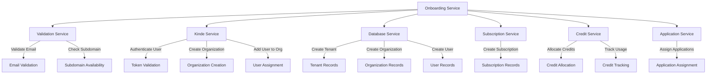
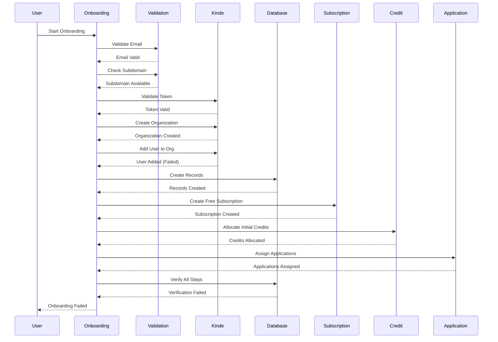

# Onboarding High-Level Design Diagram

## Overview
This document provides a high-level design (HLD) diagram and Mermaid diagram for the onboarding workflow based on the provided logs.

## High-Level Design (HLD) Diagram

## Mermaid Sequence Diagram (Detailed Flow)

## Key Components

### 1. Onboarding Service
- Main orchestrator of the onboarding process
- Coordinates all other services
- Handles the overall workflow

### 2. Validation Service
- Validates user email for duplicates
- Checks subdomain availability
- Performs initial data validation

### 3. Kinde Service
- Handles authentication via JWT tokens
- Creates organizations in Kinde
- Manages user-organization assignments
- Note: User assignment step failed in the logs

### 4. Database Service
- Creates tenant records
- Creates organization records
- Creates user records
- Performs final verification

### 5. Subscription Service
- Creates free subscription plans
- Manages subscription records
- Handles plan-specific configurations

### 6. Credit Service
- Allocates initial credits to organizations
- Tracks credit usage
- Manages credit balances

### 7. Application Service
- Assigns applications to tenants
- Configures application-specific settings
- Manages application access

## Workflow Steps

1. **Initialization**: Onboarding process starts
2. **Email Validation**: Check for duplicate emails
3. **Subdomain Generation**: Create/validate unique subdomain
4. **Authentication**: Validate JWT token and user info
5. **Kinde Setup**: Create organization and add user
6. **Database Creation**: Create tenant, org, and user records
7. **Subscription Creation**: Set up free subscription
8. **Credit Allocation**: Allocate initial credits
9. **Application Assignment**: Assign applications to tenant
10. **Verification**: Verify all steps completed successfully

## Failure Points Identified

1. **Kinde User Assignment**: All endpoints failed with "Invalid organization" errors
2. **Final Verification**: PostgreSQL syntax error during verification

## Recommendations

1. Investigate Kinde API organization validation
2. Review PostgreSQL query syntax in verification step
3. Add better error handling for Kinde API failures
4. Implement fallback mechanisms for critical steps