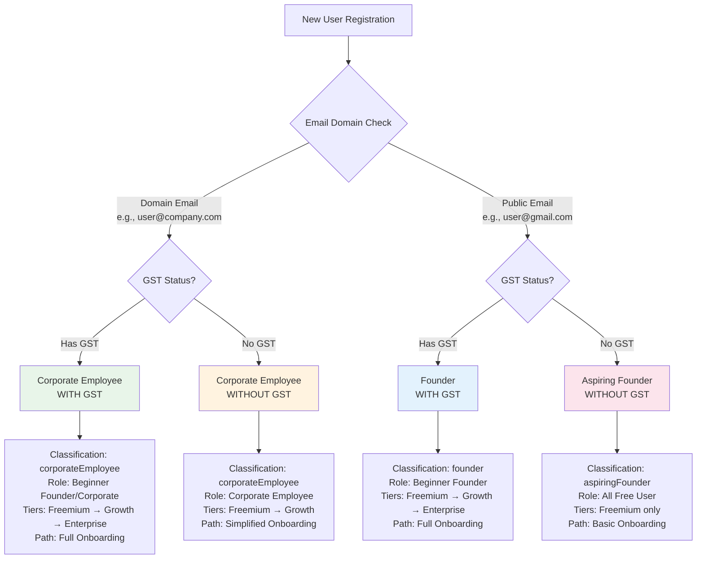
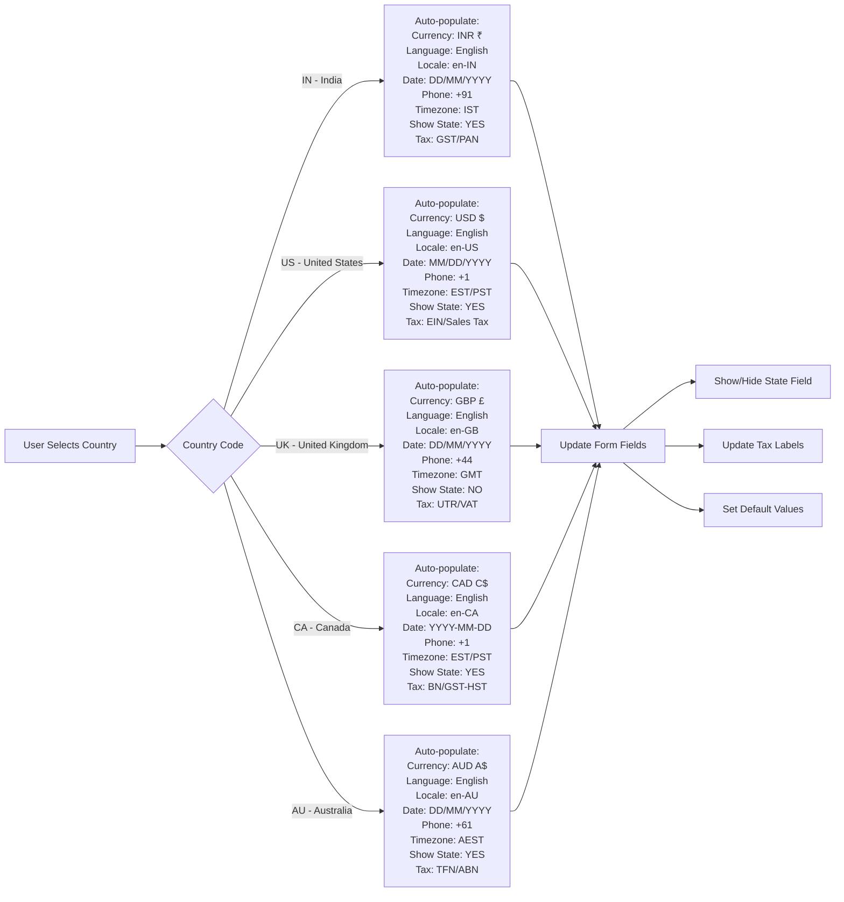
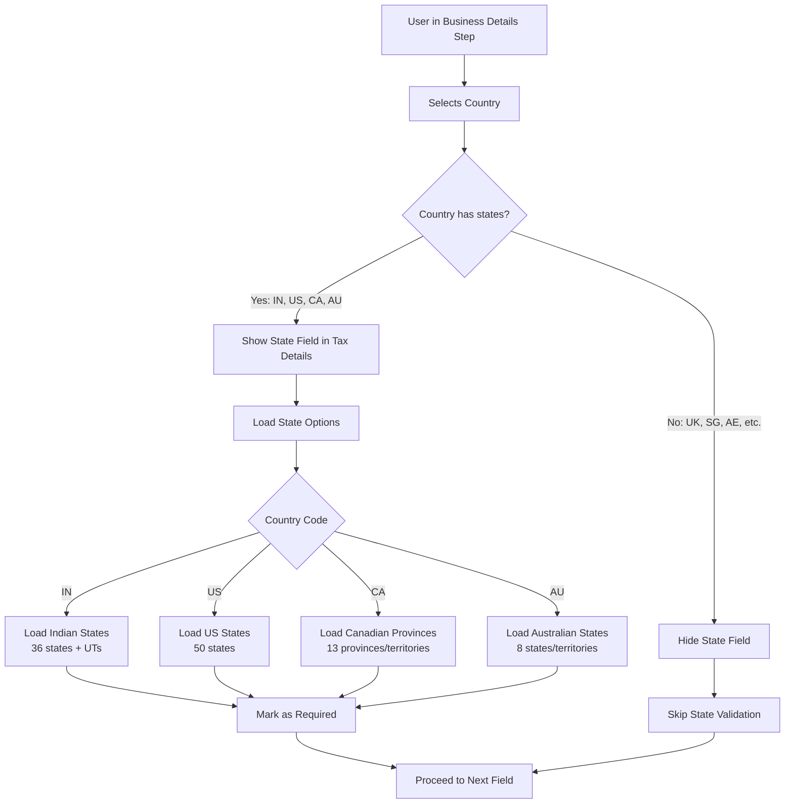
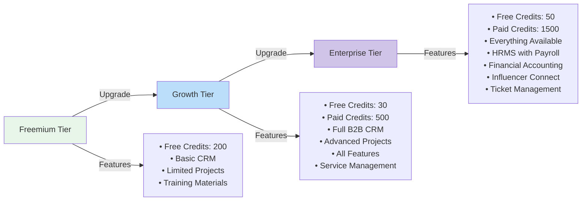

# Onboarding Flow Visual Summary

## Quick Reference Guide

This document provides visual diagrams and quick reference tables for the onboarding enhancement plan.

---

## 1. User Classification Decision Tree



---

## 2. Onboarding Step Flow Comparison

### Before (Current - 9 Steps)
```
┌─────────────────────────────────────────────────────────────┐
│  1. Company Type                                            │
├─────────────────────────────────────────────────────────────┤
│  2. State                                                   │
├─────────────────────────────────────────────────────────────┤
│  3. Business Details                                        │
├─────────────────────────────────────────────────────────────┤
│  4. Team                                                    │
├─────────────────────────────────────────────────────────────┤
│  5. Personal Details ❌ (TO BE REMOVED)                     │
├─────────────────────────────────────────────────────────────┤
│  6. Tax Details                                             │
├─────────────────────────────────────────────────────────────┤
│  7. Admin Details                                           │
├─────────────────────────────────────────────────────────────┤
│  8. Preferences                                             │
├─────────────────────────────────────────────────────────────┤
│  9. Review                                                  │
└─────────────────────────────────────────────────────────────┘
```

### After (New - 5 Steps)
```
┌─────────────────────────────────────────────────────────────┐
│  1. Business Details ✨                                     │
│     • Company name, type, size                              │
│     • Country selection (triggers localization)             │
│     • Industry, description                                 │
│     • GSTIN (conditional)                                   │
└─────────────────────────────────────────────────────────────┘
                          ↓
┌─────────────────────────────────────────────────────────────┐
│  2. Tax Details ✨                                          │
│     • Tax registration status                               │
│     • VAT/GST registration                                  │
│     • Tax IDs (PAN, GSTIN, EIN, etc.)                      │
│     • State (conditional based on country)                  │
│     • Billing & mailing addresses                           │
└─────────────────────────────────────────────────────────────┘
                          ↓
┌─────────────────────────────────────────────────────────────┐
│  3. Admin Details ✨                                        │
│     • Admin email & mobile                                  │
│     • Contact information                                   │
│     • Job title, department, authority                      │
│     • Billing & support emails                              │
│     • Company website                                       │
└─────────────────────────────────────────────────────────────┘
                          ↓
┌─────────────────────────────────────────────────────────────┐
│  4. Team Setup ✨ (MOVED FROM STEP 4)                      │
│     • Add team members                                      │
│     • Assign roles                                          │
│     • Set permissions                                       │
└─────────────────────────────────────────────────────────────┘
                          ↓
┌─────────────────────────────────────────────────────────────┐
│  5. Review & Submit ✨ (ENHANCED)                          │
│     • Comprehensive summary                                 │
│     • Edit any section                                      │
│     • Terms acceptance                                      │
│     • Final submission                                      │
└─────────────────────────────────────────────────────────────┘
```

---

## 3. Country-Based Localization Flow



---

## 4. Validation Rules Matrix

| Field | Required For | Validation Pattern | Error Message |
|-------|-------------|-------------------|---------------|
| **Business Details** |
| Company Name | All users | Min 2, Max 100 chars | "Company name is required" |
| Business Type | All users | Must select from list | "Business type is required" |
| Country | All users | Must select from list | "Country is required" |
| GSTIN | withGST, vatGstRegistered=true | `^[0-9]{2}[A-Z]{5}[0-9]{4}[A-Z]{1}[1-9A-Z]{1}Z[0-9A-Z]{1}$` | "Invalid GSTIN format" |
| **Tax Details** |
| PAN Number | IN + taxRegistered | `^[A-Z]{5}[0-9]{4}[A-Z]{1}$` | "Invalid PAN format" |
| EIN | US + taxRegistered | Valid EIN format | "EIN is required" |
| State | Countries with states | Must select from list | "State is required" |
| Billing Address | All users | Min 10 chars | "Billing address is required" |
| **Admin Details** |
| Admin Email | All users | Valid email format | "Admin email is required" |
| Admin Mobile | withGST, enterprise | Valid phone format | "Mobile required for verification" |
| Support Email | All users | Valid email format | "Support email is required" |
| Website | All users | Valid URL with http/https | "Valid website URL required" |
| **Review** |
| Terms Accepted | All users | Must be true | "Must accept terms to continue" |

---

## 5. Enhanced Review Page Layout

```
┌─────────────────────────────────────────────────────────────────┐
│                    ✓ Review Your Information                    │
│                                                                 │
│  Badge: [Corporate Employee with GST]                          │
│                                                                 │
│  "Review your business profile and confirm all details         │
│   before submission"                                            │
└─────────────────────────────────────────────────────────────────┘

┌─────────────────────────────────────────────────────────────────┐
│  🏢 Business Details                              [Edit Step 1] │
├─────────────────────────────────────────────────────────────────┤
│  Company Name:        Acme Innovations Pvt Ltd                  │
│  Business Type:       Technology & Software                     │
│  Organization Size:   51-200 employees                          │
│  Country:            India                                      │
│  Industry:           Technology                                 │
│  Description:        "Building AI-first CRM solutions..."       │
│  GSTIN:              22AAAAA0000A1Z5                           │
└─────────────────────────────────────────────────────────────────┘

┌─────────────────────────────────────────────────────────────────┐
│  📄 Tax & Compliance Details                     [Edit Step 2] │
├─────────────────────────────────────────────────────────────────┤
│  Tax Registered:      ✓ Yes                                     │
│  VAT/GST Registered:  ✓ Yes                                     │
│  PAN Number:          ABCDE1234F                                │
│  GSTIN:              22AAAAA0000A1Z5                           │
│  State:              Maharashtra                                │
│                                                                 │
│  Billing Address:     123 Business Park, Andheri East          │
│  City:               Mumbai                                     │
│  State:              Maharashtra                                │
│  Postal Code:        400069                                     │
│                                                                 │
│  Mailing Address:     ✓ Same as billing address                │
└─────────────────────────────────────────────────────────────────┘

┌─────────────────────────────────────────────────────────────────┐
│  👤 Administrator & Contact                      [Edit Step 3] │
├─────────────────────────────────────────────────────────────────┤
│  Admin Email:         admin@acmeinnovations.com                 │
│  Admin Mobile:        +91 98765 43210                          │
│  Salutation:         Mr.                                        │
│  Job Title:          Chief Executive Officer                    │
│  Department:         Executive                                  │
│  Authority Level:    CEO                                        │
│  Preferred Contact:  Email                                      │
│  Direct Phone:       +91 22 1234 5678                          │
│  Billing Email:      billing@acmeinnovations.com               │
│  Support Email:      support@acmeinnovations.com               │
│  Website:            https://www.acmeinnovations.com           │
└─────────────────────────────────────────────────────────────────┘

┌─────────────────────────────────────────────────────────────────┐
│  👥 Team Members                                 [Edit Step 4] │
├─────────────────────────────────────────────────────────────────┤
│  ┌───────────────────────────────────────────────────────────┐ │
│  │ 👤 John Smith                                             │ │
│  │    SALES MANAGER                                          │ │
│  │    john.smith@acmeinnovations.com                        │ │
│  └───────────────────────────────────────────────────────────┘ │
│                                                                 │
│  ┌───────────────────────────────────────────────────────────┐ │
│  │ 👤 Sarah Johnson                                          │ │
│  │    MARKETING LEAD                                         │ │
│  │    sarah.j@acmeinnovations.com                           │ │
│  └───────────────────────────────────────────────────────────┘ │
└─────────────────────────────────────────────────────────────────┘

┌─────────────────────────────────────────────────────────────────┐
│  ☑ Terms & Conditions                                          │
├─────────────────────────────────────────────────────────────────┤
│  □ I accept the Terms and Conditions and Privacy Policy *      │
│                                                                 │
│  By checking this box, you agree to our terms of service       │
│  and privacy policy. You must accept to continue.              │
└─────────────────────────────────────────────────────────────────┘

┌─────────────────────────────────────────────────────────────────┐
│  ℹ Ready to submit? This will create your account and          │
│    initialize your workspace.                                   │
│                                                                 │
│                    [← Back]  [Submit Onboarding →]             │
└─────────────────────────────────────────────────────────────────┘
```

---

## 6. State Field Conditional Logic



---

## 7. Feature Access by Classification

| Feature | Aspiring Founder | Founder with GST | Corporate (No GST) | Corporate with GST |
|---------|-----------------|------------------|-------------------|-------------------|
| **CRM** |
| Leads | ✅ | ✅ | ✅ | ✅ |
| Contacts | ✅ | ✅ | ✅ | ✅ |
| Accounts | ✅ | ✅ | ✅ | ✅ |
| Opportunities | ✅ | ✅ | ✅ | ✅ |
| Form Builder | ❌ | ❌ | ❌ | ✅ |
| **Project Management** |
| Basic Projects | ✅ | ✅ | ✅ | ✅ |
| Workspace Creation | ❌ | ❌ | ❌ | ✅ |
| AI Features | ❌ | ❌ | ❌ | ✅ |
| Team Features | ❌ | ❌ | ❌ | ✅ |
| **HRMS** |
| Onboarding | ❌ | ❌ | ❌ | ✅ |
| Positions & Departments | ❌ | ❌ | ❌ | ✅ |
| Organization Management | ❌ | ❌ | ❌ | ✅ |
| Payroll | ❌ | ❌ | ❌ | ✅ |
| **Operations** |
| Order Management | ❌ | ❌ | ❌ | ✅ |
| Inventory | ❌ | ❌ | ❌ | ✅ |
| **Financial** |
| GST Invoicing | ❌ | ✅ | ❌ | ✅ |
| Financial Accounting | ❌ | ❌ | ❌ | ✅ |
| **Training** |
| Dopkit Academy | ✅ | ✅ | ✅ | ✅ |
| All Modules | ❌ | ✅ | ✅ | ✅ |
| **Credits** |
| Free Credits | 200 | 200 | 200 | 200 |
| Paid Credits | ❌ | Available | Available | Available |

---

## 8. Tier Progression Path



---

## 9. Implementation Phases Timeline

```
Week 1-2: Foundation
├── Update type definitions
├── Create country configurations
├── Implement categorization logic
└── Add unit tests

Week 2-3: Geographic Localization
├── Implement auto-population
├── Add state field logic
├── Update tax labels
└── Test country switching

Week 3-4: Step Restructuring
├── Update flow configuration
├── Remove Personal Details step
├── Reorder components
└── Update navigation

Week 4-5: Enhanced Review Page
├── Redesign review component
├── Add edit functionality
├── Implement conditional display
└── Add terms acceptance

Week 5-6: Validation Framework
├── Implement field validation
├── Add step validation
├── Backend validation updates
└── Integration testing

Week 6-7: Testing & Refinement
├── Unit testing
├── Integration testing
├── User acceptance testing
└── Performance optimization

Week 7-8: Documentation & Deployment
├── Update documentation
├── Deploy to staging
├── Final testing
└── Production deployment
```

---

## 10. Quick Reference: Key Files to Modify

### Frontend Files
```
wrapper/frontend/src/features/onboarding/
├── config/
│   └── flowConfigs.ts ⚠️ UPDATE: New step order
├── components/
│   ├── FlowSelector.tsx ⚠️ UPDATE: Classification logic
│   └── steps/
│       ├── BusinessDetailsStep.tsx ⚠️ UPDATE: Country selection
│       ├── TaxDetailsStep.tsx ⚠️ UPDATE: Conditional state field
│       ├── AdminDetailsStep.tsx ✅ KEEP: Maintain structure
│       ├── TeamStep.tsx ⚠️ MOVE: To step 4
│       ├── PersonalDetailsStep.tsx ❌ REMOVE: Eliminate
│       └── ReviewStep.tsx ⚠️ ENHANCE: Complete redesign
├── schemas/
│   └── index.ts ⚠️ UPDATE: Add new types and validations
└── hooks/
    └── useOnboarding.ts ⚠️ UPDATE: New validation logic
```

### Backend Files
```
wrapper/backend/src/features/onboarding/
├── services/
│   ├── unified-onboarding-service.js ⚠️ UPDATE: Classification
│   └── onboarding-validation-service.js ⚠️ UPDATE: New rules
└── routes/
    └── core-onboarding.js ⚠️ UPDATE: API endpoints
```

---

## 11. Testing Checklist

### Unit Tests
- [ ] User classification logic
- [ ] Email domain verification
- [ ] Country configuration loading
- [ ] State field conditional logic
- [ ] Validation rules for each field
- [ ] Form state management

### Integration Tests
- [ ] Complete onboarding flow (all 4 scenarios)
- [ ] Country switching and auto-population
- [ ] Step navigation and data persistence
- [ ] Review page edit functionality
- [ ] Form submission and API integration

### User Acceptance Tests
- [ ] Aspiring Founder path (No GST, No Domain)
- [ ] Founder with GST path (GST, No Domain)
- [ ] Corporate Employee path (No GST, Domain)
- [ ] Corporate with GST path (GST, Domain)
- [ ] India-specific flow with state selection
- [ ] International flows (US, UK, CA, AU)

### Performance Tests
- [ ] Page load times < 2 seconds
- [ ] Form validation response < 100ms
- [ ] API response times < 500ms
- [ ] Smooth step transitions

---

## 12. Success Criteria

✅ **Completion Rate**: 80%+ users complete onboarding  
✅ **Time to Complete**: < 10 minutes average  
✅ **Error Rate**: < 5% validation errors  
✅ **User Satisfaction**: 4.5/5 rating  
✅ **Mobile Responsive**: Works on all devices  
✅ **Accessibility**: WCAG 2.1 AA compliant  
✅ **Performance**: Lighthouse score > 90  

---

## Conclusion

This visual summary provides quick reference diagrams and tables for implementing the onboarding enhancement plan. Use this alongside the main [`ONBOARDING_ENHANCEMENT_PLAN.md`](ONBOARDING_ENHANCEMENT_PLAN.md:1) document for complete implementation guidance.
