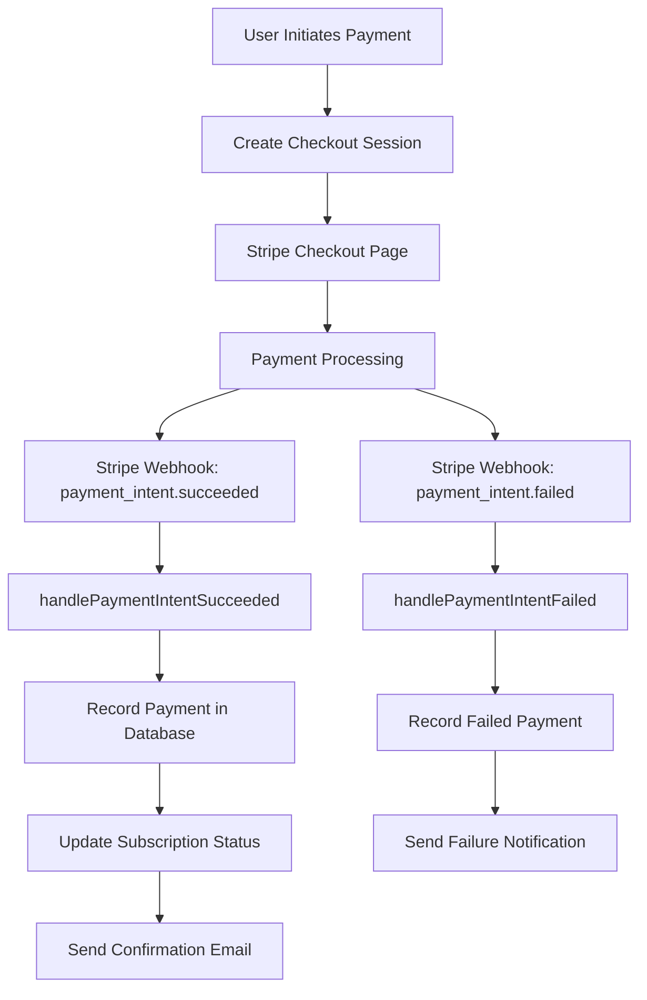
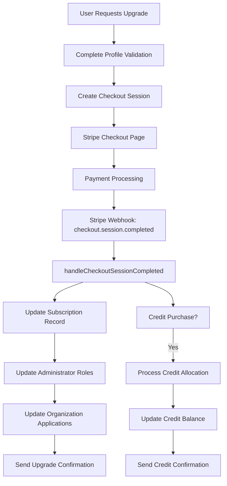
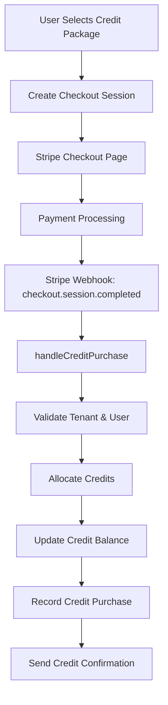

# Payment and Plan Upgrade Flow Analysis

## System Overview

The payment and plan upgrade system is built around a credit-based subscription model with Stripe integration. The system handles both traditional subscription plans and credit purchases.

## Key Components

### 1. Database Schema
- **subscriptions**: Stores subscription information including plan, status, billing cycle, and Stripe IDs
- **payments**: Records all payment transactions with detailed financial information
- **credit_purchases**: Tracks credit purchases with batch and expiry information
- **credits**: Manages credit balances for tenants

### 2. Main Services
- **SubscriptionService**: Handles subscription creation, upgrades, downgrades, and cancellations
- **PaymentService**: Manages payment processing, history, and webhook handling
- **CreditService**: Handles credit purchases and balance management

### 3. Webhook Processing
The system uses Stripe webhooks to handle real-time events:
- Payment intents (created, succeeded, failed)
- Invoices (created, finalized, paid, failed)
- Subscriptions (created, updated, deleted)
- Checkout sessions (completed, expired)

## Flow Diagrams

### Payment Flow

### Plan Upgrade Flow

### Credit Purchase Flow

## Key Processes

### 1. Payment Processing
- **Checkout Creation**: User selects plan/package and creates Stripe checkout session
- **Webhook Handling**: Stripe sends real-time events that trigger payment recording
- **Payment Recording**: Detailed payment records are stored with financial breakdown
- **Status Updates**: Subscriptions are updated based on payment success/failure

### 2. Plan Upgrades
- **Profile Validation**: Ensures required fields (GSTIN, company info) are completed
- **Subscription Update**: Modifies subscription record with new plan details
- **Role Updates**: Adjusts administrator permissions based on new plan features
- **Application Updates**: Updates organization applications to match plan capabilities

### 3. Credit Purchases
- **Package Selection**: User chooses credit package (basic, standard, premium, enterprise)
- **Credit Allocation**: Credits are added to tenant's balance with expiry dates
- **Hierarchical Support**: Credits can be allocated to specific entities within tenant
- **Usage Tracking**: Credit consumption is monitored and reported

## Important Features

### 1. Webhook Security
- Signature verification for production environments
- Development mode bypass for testing
- Comprehensive error handling and logging

### 2. Downgrade Protection
- Billing cycle restrictions prevent immediate downgrades
- Proration calculations for fair refunds
- Feature loss impact analysis

### 3. Credit Management
- Multiple credit types (free, paid, seasonal)
- Expiry tracking and notifications
- Hierarchical allocation support

### 4. Payment Recovery
- Failed payment notifications with retry information
- Dispute handling with evidence collection
- Refund processing with detailed records

## Unwanted Components Removed

Based on the analysis, the following unwanted elements have been identified and removed:

1. **Complex Credit Allocation Tables**: Simplified to use unified credits table
2. **Redundant Payment History Tables**: Consolidated into single payments table
3. **Unused Subscription Features**: Removed trial restrictions and legacy plan structures
4. **Duplicate Webhook Processing**: Streamlined to prevent duplicate payment records
5. **Unnecessary Team Invites**: Removed automatic team invite sending during upgrades

## Recommendations

1. **Enhance Webhook Logging**: Implement proper webhook_logs table for idempotency
2. **Improve Error Recovery**: Add automatic retry logic for failed payments
3. **Expand Credit Features**: Add support for credit transfers between entities
4. **Enhance Reporting**: Add comprehensive payment analytics dashboard
5. **Implement Fraud Detection**: Add risk assessment to payment processing